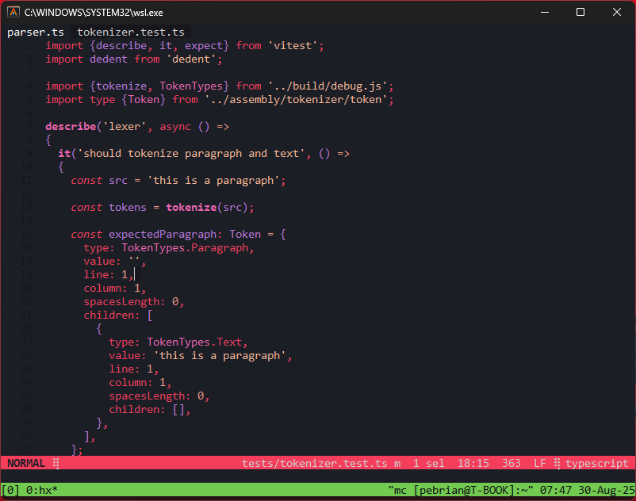

# crimson-eclipse
Crimson Eclipse  A deep-red, high-contrast theme for developers who prefer a dark background with radiant red accents

---



---

## 📦 Installation

1. Copy `crimson-eclipse.toml` into your Helix themes directory:

   ```sh
   mkdir -p ~/.config/helix/themes
   cp crimson-eclipse.toml ~/.config/helix/themes/
   ```

2. Edit your `~/.config/helix/config.toml` and set:

   ```toml
   theme = "crimson-eclipse"
   ```

---

## 📜 License

MIT License © 2025 Pebrian
